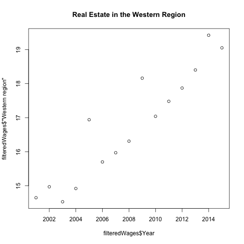

Industry Wages in Canada
========================================================
author: Rachel Hartviksen
date: 2021 05 12
autosize: true

Industry Wages in Canada Graphing Application
========================================================

A great application for evaluating the trends in wages in various industries and regions in Canada.

This application <https://rhartviksen.shinyapps.io/industryWagesCanada/> can be useful to
- evaluate wage trends in various industries and regions
- compare wages between different regions within Canada

Metrics
========================================================


The application has data for 124 industries.

The data is available for the following regions:

```
[1] "Total, Ontario regions"
[1] "Eastern region"
[1] "Central region"
[1] "Western region"
[1] "Northern region"
```

Example
========================================================
Here is the average Real Estate wages in the western region of Canada:


Who needs this application
========================================================
- This application is particularly useful for people working in Canada or looking for work in Canada.
- They can compare their wages to the average wage from 2001 and 2015 for their region.
- They can also explore whether their industry has higher wages in different regions.
- Trends in their region can help them forecast jobs in their industries.
- This data may help people discover other industries with better wages in which they would be interested or qualified to work.

